# CritiqUX — System Architecture Design Document

> **Author Role**: FAANG Staff Software Engineer & Principal Architect
> **Platform**: CritiqUX — AI-Powered UX Review Platform
> **Date**: March 2026
> **Status**: Phase 1 — Architecture Design (Pre-Implementation)

---

## Table of Contents

1. [Executive Summary](#1-executive-summary)
2. [System Architecture](#2-system-architecture)
3. [Backend Architecture](#3-backend-architecture)
4. [Frontend Architecture](#4-frontend-architecture)
5. [AI Architecture](#5-ai-architecture)
6. [Database Architecture](#6-database-architecture)
7. [Storage Architecture](#7-storage-architecture)
8. [Billing Architecture](#8-billing-architecture)
9. [Security Architecture](#9-security-architecture)
10. [Scaling Architecture](#10-scaling-architecture)
11. [Risk Analysis](#11-risk-analysis)
12. [Proposed Improvements](#12-proposed-improvements)

---

## 1. Executive Summary

CritiqUX is a SaaS platform that uses AI (OpenAI GPT-4o Vision) to analyze UI/UX designs, generate detailed UX scores, provide actionable feedback, run A/B design comparisons, extract design tokens, and spy on competitor designs. It targets product teams, designers, and startups who want fast, expert-level UX feedback without hiring a UX consultant.

### Core Product Capabilities

| Capability | Description |
|---|---|
| **UX Analysis** | Upload a screenshot → get a 100-point UX score with category-level breakdowns |
| **A/B Testing** | Compare two design variants with AI-scored dimensional analysis |
| **Redesign Generator** | AI-generated mockup suggestions for improving a design |
| **Design Token Extraction** | Extract colors, fonts, spacing, and grid from screenshots |
| **Competitor Spy** | Paste a URL → get a heuristic UX breakdown of a competitor's site |
| **Prototype Testing** | Analyze multi-screen flows for usability issues |
| **User Story Generator** | Generate user stories from feature descriptions |
| **Feedback Collection** | Shareable links for collecting UX feedback from real users |

### Tech Stack Decision

| Layer | Technology | Rationale |
|---|---|---|
| Framework | Next.js 14 (App Router) | SSR + API routes in one codebase, SEO for landing page, React Server Components |
| Database | Supabase (PostgreSQL) | Auth, RLS, real-time, storage, managed infra |
| AI | OpenAI GPT-4o (Vision) | Best-in-class multimodal model for image analysis |
| Payments | Stripe | Industry standard, webhooks, subscription management |
| Styling | TailwindCSS + ShadCN UI | Rapid premium UI development, accessible components |
| State | Zustand + React Query | Lightweight global state + server-state caching |
| Deployment | Vercel | Optimized for Next.js, edge functions, analytics |

---

## 2. System Architecture

### High-Level Architecture Diagram

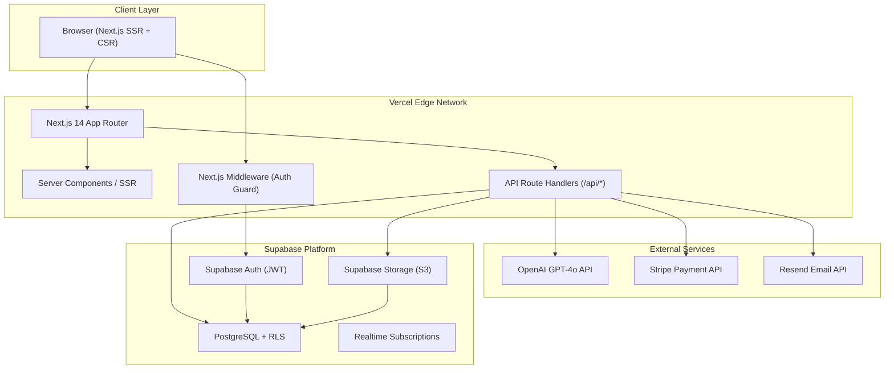

### Request Flow

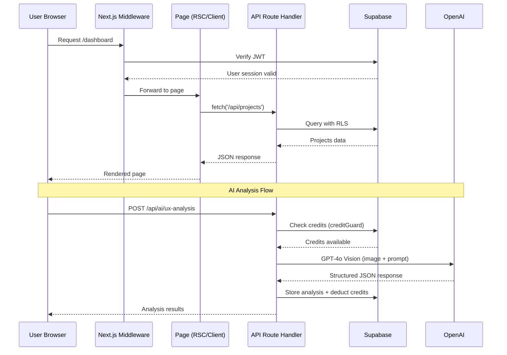

### Architectural Principles

1. **Monorepo single-deploy**: Next.js App Router houses both frontend and API — one `vercel deploy`
2. **Edge-first auth**: Next.js Middleware validates JWTs at the edge before hitting origin
3. **RLS defense-in-depth**: Even if API logic is bypassed, Supabase RLS prevents unauthorized data access
4. **AI isolation**: AI calls go through a credit guard → provider → usage logger pipeline
5. **Webhook idempotency**: Stripe events are deduplicated by event ID before processing

---

## 3. Backend Architecture

### API Route Structure

All API routes live under `/app/api/` using Next.js 14 Route Handlers:

```
/app/api/
├── auth/
│   ├── signup/route.ts          POST — create account
│   ├── login/route.ts           POST — sign in
│   ├── logout/route.ts          POST — sign out
│   └── me/route.ts              GET  — current user profile
├── projects/
│   ├── route.ts                 GET (list), POST (create)
│   └── [id]/
│       └── route.ts             GET, PUT, DELETE
├── designs/
│   ├── upload/route.ts          POST — upload screenshot
│   └── [projectId]/route.ts     GET  — list designs
├── ai/
│   ├── ux-analysis/route.ts     POST — run UX analysis
│   ├── redesign/route.ts        POST — generate redesign
│   ├── ab-test/route.ts         POST — compare two designs
│   ├── tokens/route.ts          POST — extract design tokens
│   ├── competitor/route.ts      POST — competitor spy
│   ├── prototype/route.ts       POST — prototype flow analysis
│   ├── user-stories/route.ts    POST — generate user stories
│   └── generate-document/
│       └── stream/route.ts      POST — stream document generation
├── feedback/
│   ├── link/route.ts            POST — generate feedback link
│   ├── submit/route.ts          POST — submit feedback (public)
│   └── [projectId]/route.ts     GET  — feedback for project
├── billing/
│   ├── checkout/route.ts        POST — create Stripe checkout session
│   ├── portal/route.ts          POST — create billing portal session
│   ├── webhook/route.ts         POST — Stripe webhook handler
│   └── status/route.ts          GET  — subscription status
├── teams/
│   ├── invite/route.ts          POST — invite team member
│   ├── [projectId]/route.ts     GET  — list team members
│   └── [memberId]/route.ts      DELETE — remove member
├── admin/
│   ├── users/route.ts           GET  — list all users (admin only)
│   ├── analytics/route.ts       GET  — platform analytics
│   └── prompts/route.ts         GET, PUT — manage AI prompts
└── health/route.ts              GET  — health check
```

### Backend Layered Architecture

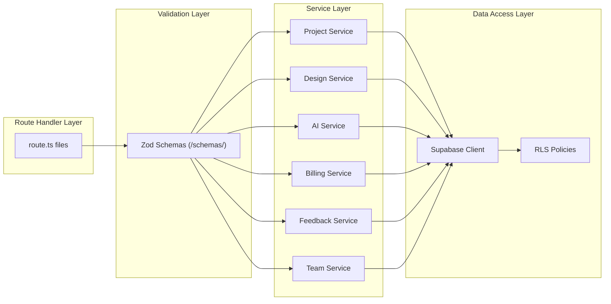

### Authentication & Authorization Flow

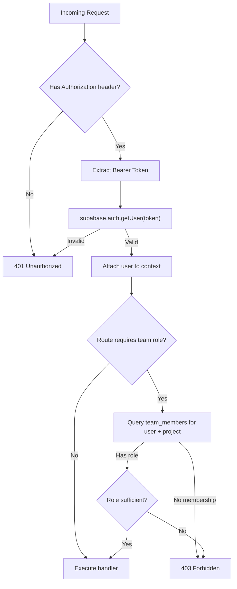

### Key Backend Patterns

| Pattern | Implementation |
|---|---|
| **Auth middleware** | `createRouteHandlerClient` from `@supabase/ssr` — extracts JWT from cookies |
| **Request validation** | Zod schemas validate body/params at route handler entry |
| **Error handling** | Centralized `ApiError` class with status codes, caught by wrapper function |
| **RBAC** | `withTeamRole(handler, ['admin', 'editor'])` HOF wraps route handlers |
| **Rate limiting** | `@upstash/ratelimit` with sliding window (10 req/min for AI, 60 req/min general) |
| **Streaming** | AI document generation uses `ReadableStream` for chunked responses |

---

## 4. Frontend Architecture

### Page Structure (App Router)

```
/app/
├── (marketing)/                 # Public layout (no sidebar)
│   ├── page.tsx                 Landing page
│   ├── pricing/page.tsx         Pricing page
│   └── layout.tsx               Marketing layout (Navbar + Footer)
├── (auth)/                      # Auth layout
│   ├── login/page.tsx
│   ├── signup/page.tsx
│   └── layout.tsx               Centered card layout
├── (dashboard)/                 # Protected layout (sidebar + topbar)
│   ├── dashboard/page.tsx       Overview stats
│   ├── projects/
│   │   ├── page.tsx             Project list
│   │   └── [id]/
│   │       ├── page.tsx         Project detail
│   │       └── analysis/
│   │           └── [analysisId]/page.tsx
│   ├── tools/
│   │   ├── ux-analysis/page.tsx
│   │   ├── ab-test/page.tsx
│   │   ├── competitor-spy/page.tsx
│   │   ├── redesign/page.tsx
│   │   ├── tokens/page.tsx
│   │   └── prototype/page.tsx
│   ├── history/page.tsx         Analysis history
│   ├── billing/page.tsx         Subscription management
│   ├── settings/page.tsx        User settings
│   └── layout.tsx               Dashboard shell (sidebar + topbar)
├── admin/                       # Admin-only
│   ├── page.tsx                 Admin dashboard
│   ├── users/page.tsx
│   └── layout.tsx
├── feedback/
│   └── [token]/page.tsx         Public feedback submission page
└── layout.tsx                   Root layout (providers, fonts, metadata)
```

### Component Architecture

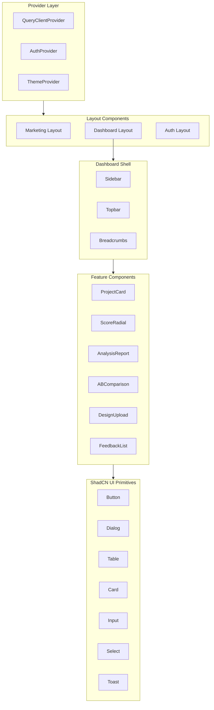

### State Management Strategy

| State Type | Tool | Usage |
|---|---|---|
| **Server state** | React Query (`@tanstack/react-query`) | Projects, analyses, designs, team members — cached with stale-while-revalidate |
| **Auth state** | Zustand (`authStore`) | Current user, session, subscription plan — synced with Supabase `onAuthStateChange` |
| **UI state** | React `useState` / Zustand | Sidebar open/closed, active tool tab, modal visibility |
| **Form state** | React Hook Form + Zod | Login, signup, project creation, feedback forms — validated client-side |
| **URL state** | Next.js `searchParams` | Filters, sort order, pagination — bookmarkable |

### Design System

| Token | Value |
|---|---|
| **Primary** | `hsl(262, 83%, 58%)` — Electric purple |
| **Secondary** | `hsl(199, 89%, 48%)` — Vivid cyan |
| **Accent** | `hsl(340, 82%, 52%)` — Hot pink |
| **Background (dark)** | `hsl(224, 71%, 4%)` — Deep navy |
| **Surface (dark)** | `hsl(215, 28%, 10%)` — Card surfaces |
| **Border** | `hsl(215, 20%, 18%)` — Subtle borders |
| **Font** | Inter (body), JetBrains Mono (code/scores) |
| **Radius** | `0.75rem` default, `1rem` cards |
| **Glassmorphism** | `backdrop-blur-xl bg-white/5 border border-white/10` |

---

## 5. AI Architecture

### AI Pipeline Architecture

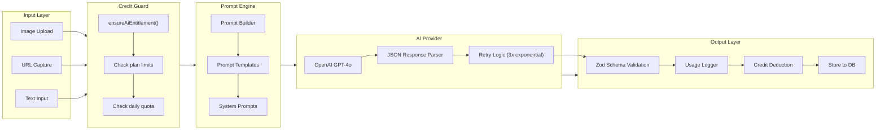

### AI Tool Matrix

| Tool | Input | Model | Output | Est. Tokens |
|---|---|---|---|---|
| **UX Analysis** | Screenshot image | GPT-4o (vision) | 100-point score, 8 categories, feedback items, suggestions | ~2,000 |
| **A/B Test Compare** | Two screenshot images | GPT-4o (vision) | Per-dimension scores, winner, justification | ~2,500 |
| **Redesign Generator** | Screenshot + instructions | GPT-4o (vision) | HTML/CSS mockup, improvement notes | ~3,000 |
| **Design Token Extractor** | Screenshot image | GPT-4o (vision) | Colors, fonts, spacing, grid system | ~1,500 |
| **Competitor Spy** | URL (screenshot via puppeteer/api) | GPT-4o (vision) | Heuristic evaluation, comparison matrix | ~2,000 |
| **Prototype Testing** | Multiple screenshots | GPT-4o (vision) | Flow analysis, usability issues, recommendations | ~3,500 |
| **User Story Generator** | Feature text description | GPT-4o (text) | Formatted user stories with acceptance criteria | ~800 |
| **Contextual Questions** | Analysis context | GPT-4o (text) | Survey/interview questions | ~600 |

### AI Scoring Schema (UX Analysis)

```
UXAnalysisResult:
  overallScore: 0-100
  categories:
    - visualHierarchy (0-100)
    - typography (0-100)
    - colorUsage (0-100)
    - spacing (0-100)
    - accessibility (0-100)
    - ctaEffectiveness (0-100)
    - navigation (0-100)
    - mobileResponsiveness (0-100)
  feedbackItems:
    - category: string
      severity: "critical" | "warning" | "suggestion"
      title: string
      description: string
      recommendation: string
  competitiveInsight: string
  summary: string
```

### Prompt Engineering Principles

1. **Persona priming**: Each prompt starts with an expert persona ("You are a Google-level UX designer with 15+ years of experience...")
2. **Structured output**: Every prompt demands `json` response format with exact field names
3. **Scoring rubric**: Explicit 0-100 rubric with benchmark examples (e.g., "80+ means Airbnb-quality")
4. **few-shot grounding**: Include 1-2 abbreviated example outputs in system prompt
5. **Token efficiency**: Category scores use integers not floats; descriptions are capped at sentence length

---

## 6. Database Architecture

### Entity-Relationship Diagram

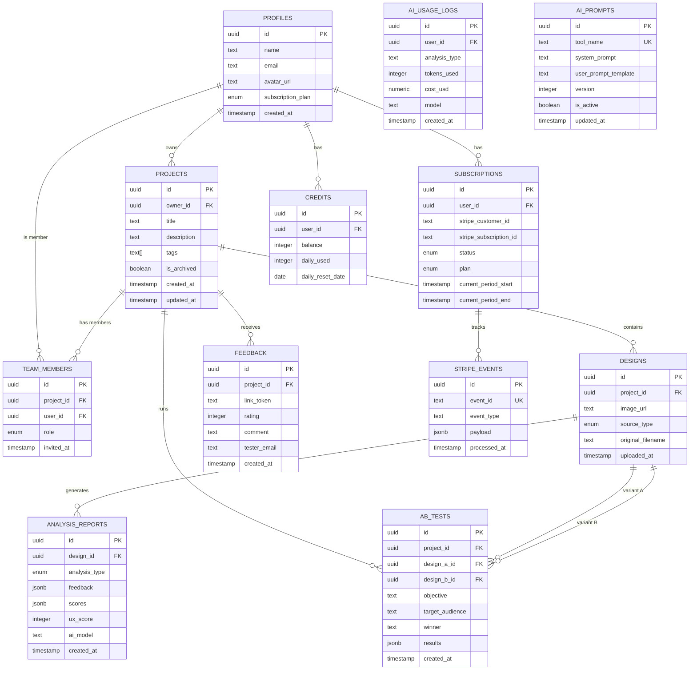

### Table Count: 11 tables

### Index Strategy

| Table | Index | Type | Rationale |
|---|---|---|---|
| `projects` | `owner_id` | B-tree | List user's projects |
| `designs` | `project_id` | B-tree | List designs in project |
| `analysis_reports` | `design_id` | B-tree | List reports for design |
| `analysis_reports` | `created_at DESC` | B-tree | History sorted by date |
| `feedback` | `project_id` | B-tree | Feedback for project |
| `feedback` | `link_token` | Unique | Public feedback submission lookup |
| `team_members` | `(project_id, user_id)` | Unique | Prevent duplicate membership |
| `subscriptions` | `user_id` | Unique | One active subscription per user |
| `credits` | `user_id` | Unique | One credit record per user |
| `stripe_events` | `event_id` | Unique | Idempotency check |
| `ai_usage_logs` | `(user_id, created_at)` | B-tree | Usage history queries |

### RLS Policy Summary

| Table | SELECT | INSERT | UPDATE | DELETE |
|---|---|---|---|---|
| `profiles` | Own row | Auto (trigger) | Own row | — |
| `projects` | Owner OR team member | Auth'd user | Owner | Owner |
| `designs` | Via project access | Project owner/editor | Project owner/editor | Project owner |
| `analysis_reports` | Via design → project | API service role | — | Project owner |
| `feedback` | Project owner | Anyone (with link_token) | — | Project owner |
| `team_members` | Project owner/member | Project owner/admin | Project owner/admin | Project owner/admin |
| `subscriptions` | Own row | Service role | Service role | — |
| `credits` | Own row | Service role | Service role | — |

---

## 7. Storage Architecture

### Supabase Storage Buckets

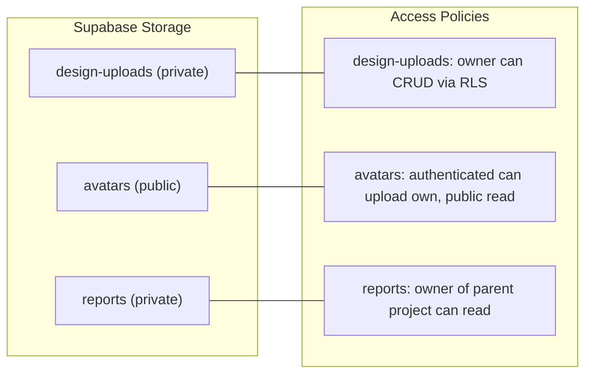

| Bucket | Visibility | Max File Size | Allowed Types | Path Pattern |
|---|---|---|---|---|
| `design-uploads` | Private | 10 MB | `image/png`, `image/jpeg`, `image/webp` | `{user_id}/{project_id}/{filename}` |
| `avatars` | Public | 2 MB | `image/png`, `image/jpeg`, `image/webp` | `{user_id}/avatar.{ext}` |
| `reports` | Private | 50 MB | `application/pdf`, `text/html` | `{project_id}/{report_id}.{ext}` |

### Upload Flow

1. Frontend requests a signed upload URL from `/api/designs/upload`
2. Frontend uploads directly to Supabase Storage (avoids proxying through API)
3. API creates `designs` record with the storage path
4. For AI analysis, the API generates a short-lived signed URL and sends it to OpenAI

---

## 8. Billing Architecture

### Subscription Model

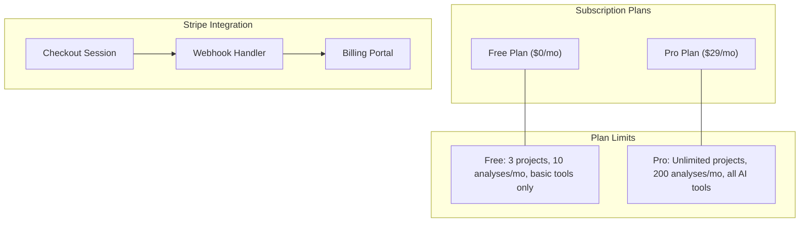

### Plan Feature Matrix

| Feature | Free | Pro |
|---|---|---|
| Projects | 3 | Unlimited |
| AI Analyses / month | 10 | 200 |
| UX Analysis | ✅ | ✅ |
| A/B Testing | ❌ | ✅ |
| Competitor Spy | ❌ | ✅ |
| Redesign Generator | ❌ | ✅ |
| Design Token Extractor | ❌ | ✅ |
| Prototype Testing | ❌ | ✅ |
| Team Collaboration | 1 member | 10 members |
| PDF Export | ❌ | ✅ |
| Priority Support | ❌ | ✅ |

### Stripe Webhook Event Handling

| Event | Action |
|---|---|
| `checkout.session.completed` | Create/update `subscriptions`, set plan to Pro, initialize credits |
| `invoice.payment_succeeded` | Reset monthly credit allowance |
| `customer.subscription.updated` | Update plan/status in DB |
| `customer.subscription.deleted` | Downgrade to Free, clear Pro limits |
| `invoice.payment_failed` | Flag subscription, notify user via email |

### Credit System Flow

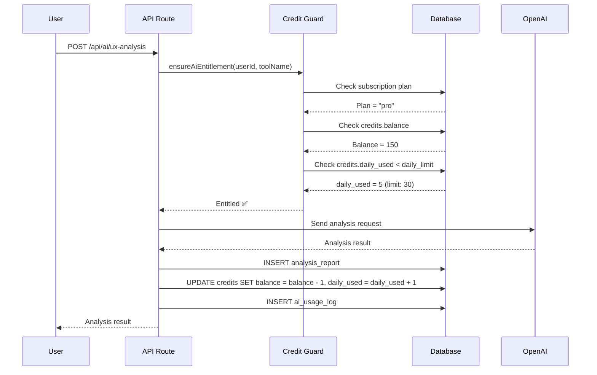

---

## 9. Security Architecture

### Defense Layers

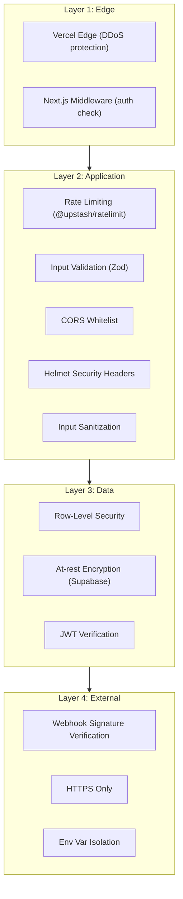

### OWASP Top 10 Mitigations

| OWASP Risk | Mitigation |
|---|---|
| **A01 Broken Access Control** | RLS on every table, RBAC middleware, team role checks |
| **A02 Cryptographic Failures** | Supabase handles encryption at rest; HTTPS enforced; no plaintext secrets |
| **A03 Injection** | Parameterized queries via Supabase client; Zod input validation |
| **A04 Insecure Design** | Rate limiting on AI endpoints; credit system prevents abuse |
| **A05 Security Misconfiguration** | Helmet headers; CORS whitelist; `.env` validation with Zod |
| **A06 Vulnerable Components** | `npm audit`; lockfile pinning; Dependabot alerts |
| **A07 Auth Failures** | Supabase Auth (bcrypt, MFA-ready); short-lived JWTs; httpOnly cookies |
| **A08 Data Integrity** | Stripe webhook signature verification; Zod schema on all inputs |
| **A09 Logging/Monitoring** | Structured logging; ai_usage_logs table; Sentry error tracking |
| **A10 SSRF** | URL validation for competitor spy; blocklist for internal IPs |

### Rate Limiting Strategy

| Endpoint Group | Limit | Window | Key |
|---|---|---|---|
| `/api/ai/*` | 10 requests | 1 minute | `userId` |
| `/api/auth/*` | 5 requests | 1 minute | `IP` |
| `/api/feedback/submit` | 20 requests | 1 minute | `IP` |
| General `/api/*` | 60 requests | 1 minute | `userId` |

---

## 10. Scaling Architecture

### Current Scale Target

| Metric | Target |
|---|---|
| Concurrent users | 500 |
| Monthly analyses | 50,000 |
| Storage | 100 GB |
| API latency (p95) | < 200ms (non-AI) |
| AI analysis latency (p95) | < 15s |

### Scaling Strategy

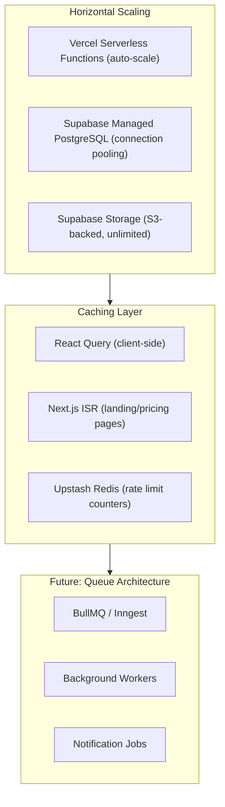

### Bottleneck Identification & Mitigation

| Bottleneck | Current Impact | Mitigation |
|---|---|---|
| **OpenAI API latency** | 5-15s per analysis | Streaming responses; optimistic UI; background processing |
| **Cold starts (serverless)** | 200-500ms first request | Vercel Edge Runtime where possible; minimal deps per route |
| **Database connections** | Serverless = many short connections | Supabase connection pooler (PgBouncer); use `@supabase/ssr` |
| **Large image uploads** | Blocks UI thread | Direct-to-storage upload; client-side compression |
| **Webhook processing** | Can timeout on busy days | Idempotent processing; async event queue (future) |

---

## 11. Risk Analysis

### Performance Risks

| Risk | Severity | Probability | Mitigation |
|---|---|---|---|
| OpenAI rate limit hit at scale | 🔴 High | Medium | Implement queue with retry backoff; consider fallback to Claude |
| Database connection exhaustion | 🟡 Medium | Medium | Supabase connection pooler enabled by default |
| Large file uploads timing out | 🟡 Medium | Low | Direct upload to storage, size validation client-side |
| Cold start latency on AI routes | 🟠 Medium | High | Keep AI routes warm with cron pings; use edge where possible |

### Security Risks

| Risk | Severity | Probability | Mitigation |
|---|---|---|---|
| JWT token theft (XSS) | 🔴 High | Low | httpOnly cookies; CSP headers; no localStorage for tokens |
| SSRF via competitor spy URL | 🔴 High | Medium | URL validation; internal IP blocklist; timeout |
| Prompt injection via user input | 🟡 Medium | Medium | Separate system/user prompts; input sanitization; output validation |
| Stripe webhook forgery | 🔴 High | Low | `stripe.webhooks.constructEvent` signature verification |
| File upload malware | 🟡 Medium | Low | File type validation; size limits; no server-side execution |

### Cost Risks

| Risk | Monthly Cost | Trigger | Mitigation |
|---|---|---|---|
| **OpenAI API overrun** | $500+ | >50K analyses at ~$0.01 each | Credit system caps usage; daily limits; alert thresholds |
| **Supabase bandwidth** | $75+ | Large image storage/retrieval | Image compression; CDN caching; client-side resize |
| **Vercel function invocations** | $40+ | High API traffic | ISR for static pages; client-side caching; debounced requests |
| **Stripe fees** | 2.9% + $0.30 | Per transaction | Annual billing option to reduce transaction count |

---

## 12. Proposed Improvements

### Immediate (Phase 1-3)

| Improvement | Impact | Effort |
|---|---|---|
| **Add Inngest/BullMQ job queue** for AI analysis | Prevents timeouts, enables retries, improves UX | Medium |
| **Implement streaming AI responses** | Users see results progressively (much better UX) | Medium |
| **Add Redis caching** for frequently accessed data | Faster dashboard loads, reduced DB load | Low |
| **Client-side image compression** before upload | Reduces storage costs, faster uploads | Low |

### Medium-term (Phase 4-6)

| Improvement | Impact | Effort |
|---|---|---|
| **Multi-model AI support** (Claude fallback) | Resilience against OpenAI outages/rate limits | Medium |
| **Realtime collaboration** via Supabase Realtime | Teams see each other's changes live | Medium |
| **Design version history** | Track design iterations over time | Low |
| **Webhook event queue** (vs synchronous processing) | More reliable Stripe event handling | Medium |
| **AI prompt A/B testing** | Continuously improve prompt quality | Medium |

### Long-term (Phase 7-9)

| Improvement | Impact | Effort |
|---|---|---|
| **Self-hosted AI models** (for token extraction) | Eliminates API costs for simple tasks | High |
| **Plugin system** for custom analysis criteria | Enterprise customization | High |
| **White-label support** | Enterprise revenue stream | High |
| **Mobile app** (React Native) | Broader market reach | High |
| **SSO/SAML** | Enterprise requirement | Medium |

### Architecture Evolution Path

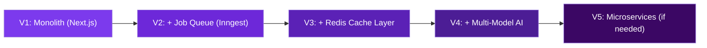

---

## Summary

This architecture is designed for a **startup shipping fast** while keeping the foundation solid enough to scale. Key design decisions:

1. **Next.js monolith** → One deployment, fast iteration, SSR + API in one repo
2. **Supabase** → Managed auth + DB + storage, RLS as a security backbone
3. **Credit-gated AI** → Controls costs while monetizing the core value
4. **Layered security** → Edge → App → Data → External, defense in depth
5. **Incremental scaling** → Start serverless, add queues and caching as traffic grows

> **Next Step**: Proceed to **Phase 2 — Repository Generation** to create the complete folder structure.
